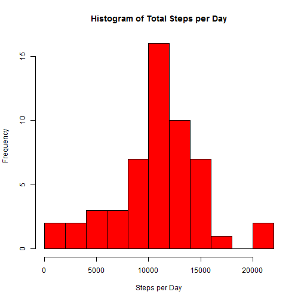
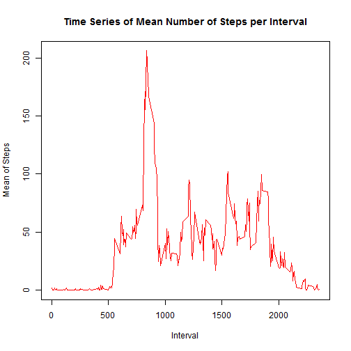
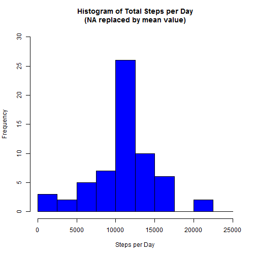
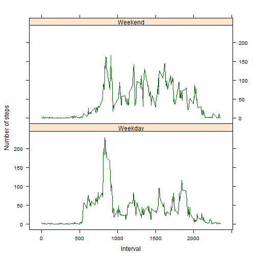

Stephen Iaquaniello

## Load the data


```r
setwd("C:/Users/Stephen Iaquaniello/Documents/R/Coursera/Class 5 Rep Research/Proj 1")
activity <- read.csv("activity.csv", header = TRUE, row.names = NULL,stringsAsFactors=FALSE)
activity$date <- as.POSIXct(activity$date, format="%Y-%m-%d")
##Turn off scientific notation
options(scipen=999)
```
## What is mean total number of steps taken per day?
For this part of the assignment, you can ignore the missing values in the dataset.

1. Calculate the total number of steps taken per day

```r
dsteps <- tapply(activity$steps,activity$date,sum)
```
2. Make a histogram of the total number of steps taken each day

```r
hist(dsteps, breaks = 10, main = "Histogram of Total Steps per Day", xlab='Steps per Day',
     col="red")
```

 

3. Calculate and report the mean and median of the total number of steps taken per day

```r
mean1 <- mean((dsteps), na.rm = TRUE)
med1 <- median((dsteps), na.rm = TRUE)
```
The mean of the total number of steps taken per day is: 10766.1886792
The median of the total number of steps taken per day is: 10765

## What is the average daily activity pattern?

1. Make a time series plot of the 5-minute interval (x-axis) and the average number of steps taken, averaged across all days (y-axis)


```r
mean_steps <- aggregate(activity$steps,by=list(activity$interval),mean, na.rm=TRUE)

# Rename
names(mean_steps) <- c("interval", "mean")

# Make the plot
plot(mean_steps$interval,mean_steps$mean,type="l",col="red",xlab="Interval", 
     ylab="Mean of Steps",main="Time Series of Mean Number of Steps per Interval")
```

 

2. Which 5-minute interval, on average across all the days in the dataset, contains the maximum number of steps?


```r
mean_steps_s <- mean_steps[order(-mean_steps$mean),]
output1 <- head(mean_steps_s,1)
```
Output (Interval#, Max Average Steps): 835, 206.1698113

## Imputing missing values

1. Calculate and report the total number of missing values in the dataset 


```r
num_miss <- sum(is.na(activity$steps))
```
The total number of missing values in the dataset is: 2304

2. Devise a strategy for filling in all of the missing values in the dataset.
3. Create a new dataset that is equal to the original dataset but with the missing data filled in.


```r
activity2  <- merge(x= activity,y=mean_steps,by.x="interval",by.y="interval", all.x=TRUE)
activity2$steps  <- ifelse(is.na(activity2$steps)==1,activity2$mean,activity2$steps)                                                    
activity2 <- activity2[, c(1:3)]    
```

4. Make a histogram of the total number of steps taken each day and Calculate and report the mean and median total number of steps taken per day. 


```r
stepsdate <- aggregate(activity2$steps, by=list(activity2$date), sum)
#rename
names(stepsdate) <- c("date", "total")

# Compute the histogram of the total number of steps each day
hist(stepsdate$total, breaks = seq(from=0, to=25000, by=2500),
     main = "Histogram of Total Steps per Day\n(NA replaced by mean value)",
     xlab='Steps per Day',ylim=c(0, 30),col="blue")
```

 

```r
##mean and median
mean2 <- mean(stepsdate$total)
med2 <- median(stepsdate$total)
```

The mean of the total number of steps taken per day is: 10766.1886792
The median of the total number of steps taken per day is: 10766.1886792

4. (Continued) Do these values differ from the estimates from the first part of the assignment?

```r
diff1 = mean2-mean1
diff2 = med2-med1
```
The difference between the non-imputed mean and imputed mean is: 0. (Given the missing values were mean-filled by interval, this is not a surprise.)

The difference between the non-imputed meadian and imputed median is: 1.1886792

4. (Continued) What is the impact of imputing missing data on the estimates of the total daily number of steps?


```r
dsteps1 <- data.frame(dsteps)
dsteps1sum <- sum(dsteps1$dsteps,na.rm=TRUE)

stepsdatesum <- sum(stepsdate$total)
diff3 <- round(stepsdatesum-dsteps1sum,0)
```

The difference between total number of steps between imputed and non-imputed data is: 86130 

## Are there differences in activity patterns between weekdays and weekends?

1. Create a new factor variable in the dataset with two levels - "weekday" and "weekend" indicating whether a given date is a weekday or weekend day.


```r
activity2$DayType<- ifelse(weekdays(activity2$date)%in%c("Saturday","Sunday"),"Weekend","Weekday")

DayTypeMean <- aggregate(activity2$steps,by=list(activity2$DayType,activity2$interval), mean)
# Rename 
names(DayTypeMean) <- c("daytype","interval", "mean")
```

2. Make a panel plot containing a time series plot (i.e. type = "l") of the 5-minute interval (x-axis) and the average number of steps taken, averaged across all weekday days or weekend days (y-axis).


```r
library(lattice)
xyplot(mean ~ interval | daytype, DayTypeMean,type="l",  xlab="Interval",ylab="Number of steps", 
       col="dark green", layout=c(1,2))
```

 

There is a higher peak earlier on weekdays, and more activity overall on weekends. 


